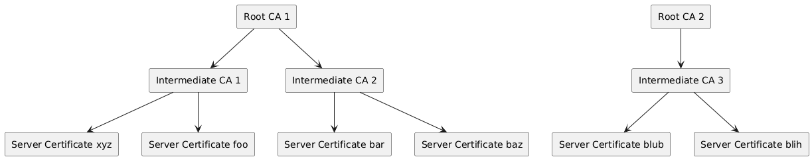
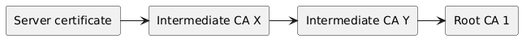

After learning about the SSL handshake in [Playing around with
UML](/posts/playing_around_with_architecture_diagrams/) I now want to answer a
few more questions to fill in the picture.

When a request is made from a client to a server, the client specifies which protocol
it wants to use. In the case of http, the client might specify that it wants to establish
an encrypted connection by using https.

When a https request is sent out, a handshake is carried out between the client
and the server. In essence, the client tells the server it would like to use an
encrypted connection. The server then offers its certificate. The client uses
the public key contained within the certificate to encrypt a pre-master key and
sends it to the server. The server can decrypt it and now both parties can use
this key (with some modifications - turning the pre-master key into a master
key) to encrypt their messages. Since both the client (it created it) and the
server (it has the private key to decrypt it) have the master key, they can
read each others messages. And the messages are encrypted while in transit. So
that's the part of the actual communication at a high level. 

The following diagram visualizes this process. 

@startuml

Client -> Server : request
Server --> Client : certificate
note left of Server : Certificate (fullchain.pem)
note right of Server : Certificate mit private key\n (privkey.pem) bleibt auf Server
Client -> Client : generate pre-master key, encrypt it with public key
Client -> Server : send encrypted pre-master key
Client -> Client
Server -> Server
note left Server : both client and server\ndo some magic to get master key
Client -> Client : encrypt data with master key
Client -> Server : exchange encrypted data
Server -> Server : encrypt data with master key
Server --> Client

@enduml

Now what about the certificates that lay on the server? These are a mystery to me. There
are two of them. One of them may be called `fullchain` and the other `privkey`.
So thinking about this and recollecting what I have read, these should serve the following purposes:

- `fullchain` holds information which enables the client to verify the chain of
  trust (whatever that means)
- `privkey` will be the certificate which contains the private key. Then this
  would mean that this certificate will never leave the browser. If that is
  true, the `fullchain` certificate will also contain the public key. Since in
  my configuration there is no other certificate.

Let's check what we got so far. Gemini and a quick verification web search
tell me that the above reasoning is correct. The `fullchain` certificate
contains the public key, some info about the certificate, like who it was issued
to, by whom (Certificate Authority) and when it will expire. Beyond that it contains
the intermediate CA or CAs which enable the client to trace the chain of trust 
back to the Root CA.

Now what are those Certificate Authorities? It starts with the Root CAs. These
are a few trusted authorities. There is a list of those installed in a browser.
So when the browser receives a certificate, it will check the intermediate
authorities and trace them back to a root authority. If the root authority is
trusted (i.e. is stored in the browsers list) all is fine. 

Here's how this hierarchy might look like:

But how can this be checked? There would need to be some way for the browser to
verify that the root authority is legit and that it trusts the intermediate
authorities. 

To do this the browser must check the digital signature of each certificate in
the chain. When a CA issues a certificate it calculates the hash over the certificates
content. It then encrypts the hash using the CAs private key. This encrypted hash
is attached to the issued certificate.

The client will upon receiving a certificate calculate the hash of it. It will
then decrypt the signature using the public key of the CA which signed it. If
the decrypted signature matches the calculated hash, the CAs certificate is
trusted.

The following diagram is a first attempt at working with icon libs in PlantUML.
This is an attempt to better understand how the chain of trust is verified.

@startuml

!define osaPuml https://raw.githubusercontent.com/Crashedmind/PlantUML-opensecurityarchitecture2-icons/master
!include osaPuml/Common.puml
!include osaPuml/User/all.puml
!include osaPuml/Hardware/all.puml
!include osaPuml/Misc/all.puml
!include osaPuml/Server/all.puml
!include osaPuml/Site/all.puml

' Devices
osa_laptop(client, "Client", "Firefox", "Browser")
osa_server(server, "Server", "nginx", "Web server")

osa_database(operating_system, "Operating System", "OS", "Operating System")

together {
  osa_server(intermediate_ca, "Intermediate CA", "Certificate Authority", "Certificate Authority")
  osa_server(root_ca, "Root CA", "Certificate Authority", "Certificate Authority")
}

' Certificates
osa_contract(server_certificate, "Server Fullchain Certificate", "Certificate","Certificate")

rectangle "Certificate Bundle" as certs {
  osa_contract(intermediate_ca_certificate, "Intermediate CA Certificate", "Certificate","Certificate")
  osa_contract(root_ca_certificate, "Root CA Certificate", "Certificate","Certificate")
}

client -> server : request 
server -> server_certificate : provide
server_certificate -> client 
server_certificate -> intermediate_ca_certificate : contains 

server_certificate --> intermediate_ca: signed by
intermediate_ca_certificate --> root_ca: signed by
root_ca_certificate --> operating_system: trusted by

@enduml

Let's explore how the certificates get checked by the client.

@startuml

start

:receive certificate;
:start walking chain of trust;
floating note right 
  the certificate usually contains 
  certificates of all 
  intermediate CAs and root CA
end note
while (is not root CA?) is (true)
  :calculate hash of certificate content;
  :decrypt certificate signature using public key of issuer;
  :compare resulting hash with calculated hash;
  if (hashes match) then (yes)
    :continue down the chain;
  else (no)
    :failure;
    end
  endif
endwhile (all intermediate CAs processed) 
:verify root CA certificate against trusted anchors;
if (root CA is trusted) then (yes)
  :successfully established trust;
  stop
else (no)
  :failure;
  end
endif

@enduml
